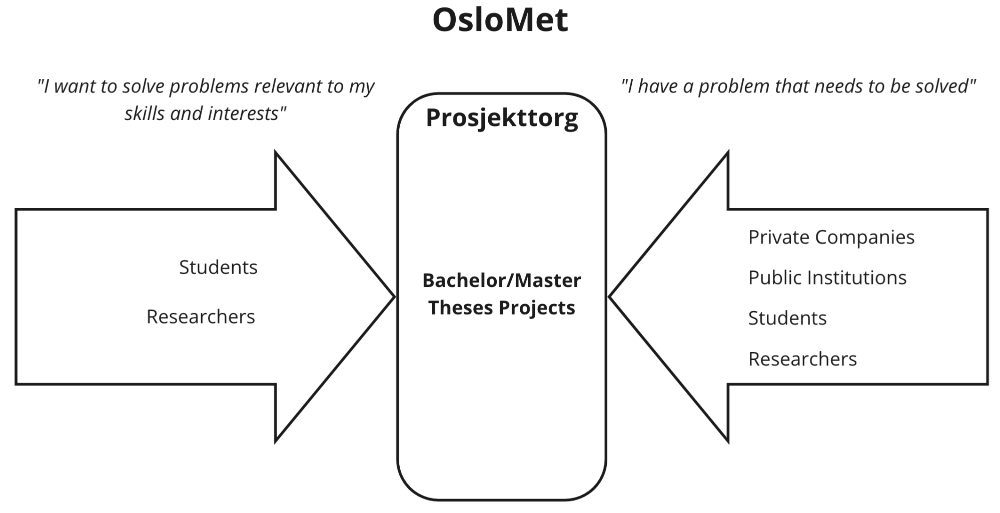

# Prosjekttorg

## Statement of need (a.k.a. "Why Prosjekttorg?")

An essential part of OsloMet’s vision is to connect our education programs with the local industry. Furthermore our [core values](https://www.oslomet.no/en/about/strategy-vision) of learning, innovation and diversity, require fluent communication between sectors (education and industry) and disciplines. However, students do not feel they have enough opportunities to work on projects in collaboration with the industry, or to communicate their competence to prospective employers. OsloMet’s two lowest scoring questions from the last [Studiebarometer (2019)](https://www.hioa.no/content/download/149923/4156877/file/Studiebarometeret%25202019%2520-%2520Institusjonsrapport.pdf) survey were:

* *I hvilken grad opplever du følgende: - Det er muligheter for å jobbe med prosjekter/oppgaver i samarbeid med arbeidslivet* - **Score 2.8/5**

* *I hvilken grad opplever du følgende: - Jeg får innføring i hvordan jeg kan formidle min egen kompetanse til potensielle arbeidsgivere* - **Score 2.7/5**

Finding relevant “real world” problems and projects available for students to work on is today an activity that depends heavily on individual efforts. It is currently up to faculty and students in the different study areas to proactively reach out to the private sector and identify projects and challenges that are relevant to the industry. These individual efforts are often redundant, inconsistent, unreliable and time-consuming, not to mention insufficient to connect OsloMet students with the immense private sector.

Furthermore, some very valuable projects can only be formulated as interdisciplinary projects (e.g. a building's centralized heating system [*Energi- og miljø i bygg*] usually requires some knowledge of automation [*Elektronikk*]; and a leg prosthesis [*Ortopediingeniør*] requires non-trivial material strength calculations [*Maskiningeniør*]). Cross-disciplinary bachelor and master theses are not only desirable, but also logistically possible, as their formal requirements and academic calendars are largely compatible. **The main bottlenecks are communication and coordination.**

Most thesis projects are currently only advertised internally, either using ad-hoc tools or in Canvas. In both cases the information flow is program-wise, meaning that potential projects are only visible for students following the same study program. This scenario is extremely common across faculties. ***Interdisciplinary projects are thus penalized***, as they require significant additional effort to be devised and communicated.

We see a need for a common platform that can reduce the friction involved in connecting project initiators (both internal and external) with relevant students across study programs and faculties.

*Prosjekttorg connects good projects with good people.*

## An open marketplace for interdisciplinary bachelor and master thesis projects

We aim to mitigate and eventually solve the problem mentioned above by creating a centralized channel for students and other parties to publish and share projects across OsloMet’s study programs.

Some immediate benefits of such a platform would be:
1. The connections between project initiators (students, faculty or external companies) and prospective collaborators (students or researchers) would be encouraged.

2. The process of formulating relevant interdisciplinary projects would be facilitated and systematized; time resources could then be reinvested into actual project work.

3. It would be easier to pool individual connections into an industrial partner network; this would lower the barrier for students to discover potential collaboration associates.

4. A single repository of high-quality guidelines and templates for project work could be developed, enabling students to be more self-sufficient.  
This is in line with the preference students express in surveys, and takes advantage of the fact that a significant proportion of the questions asked by students during the start phase of a project is largely generic and discipline agnostic.  

The platform will:
* Allow students to find relevant projects to work on.
* Allow students from all study areas to find each other to collaborate on interdisciplinary projects.
* Provide the faculty with a standardized way to invite private companies to submit problems or projects to OsloMet students.
* Allow private companies to submit rough or scoped problem descriptions for the academic community to solve.
* Maintain a single repository of transferable skills related to project execution.

## How: The platform

### Key features:

* OsloMet students, tutors, and researchers will access the platform by using the [Feide authentication system](https://www.feide.no/bruksvilkaar-tjenesteleverand%C3%B8rer-i-Feide).
* Private companies will be able to submit raw or scoped problem statements to OsloMet students and researchers.
* The platform will guide and assist private companies and students through the process of describing their problem statements and projects.
* Students and researchers will be able to search for projects to work on
* Projects can be filtered by skills/study area/industry or other tags.
* Students will be able to list their projects to find other students in other study areas that can collaborate in interdisciplinary projects.
* Projects can be moderated and curated as needed (e.g. to remove stale projects)
* Projects will be listed and classified according to the following project life cycle:
  * Raw Idea/Concept
  * Scoped project/problem statement
  * Active project
  * Completed project

* Completed projects will be listed in a gallery for future reference and to prove the platform’s value to prospective participants.

## Project timeline
*Prosjekttorg* is still an idea, and has not acquired project status. As such, its development is conditioned to my obtaining funding or meeting interested contributors.

If you have read so far and are interested in taking a look, there is a proof of concept running at [prosjekttorg.com](https://damp-fjord-48681.herokuapp.com/).
